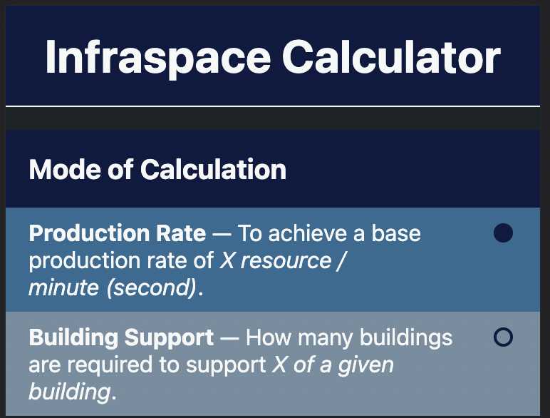
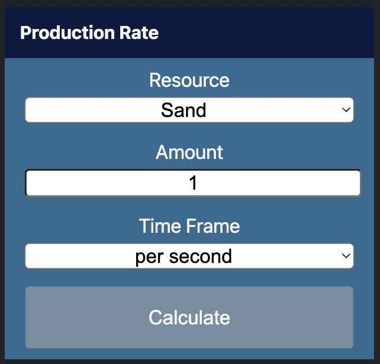
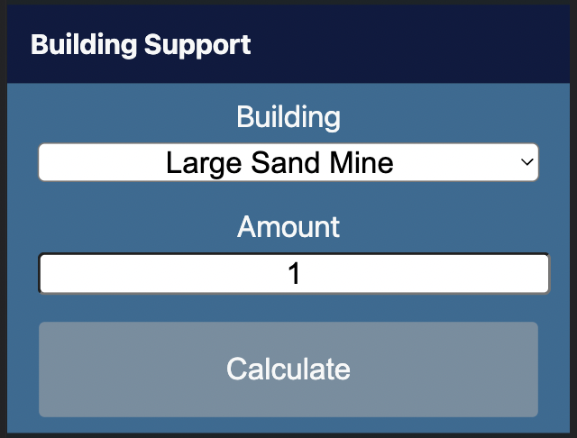
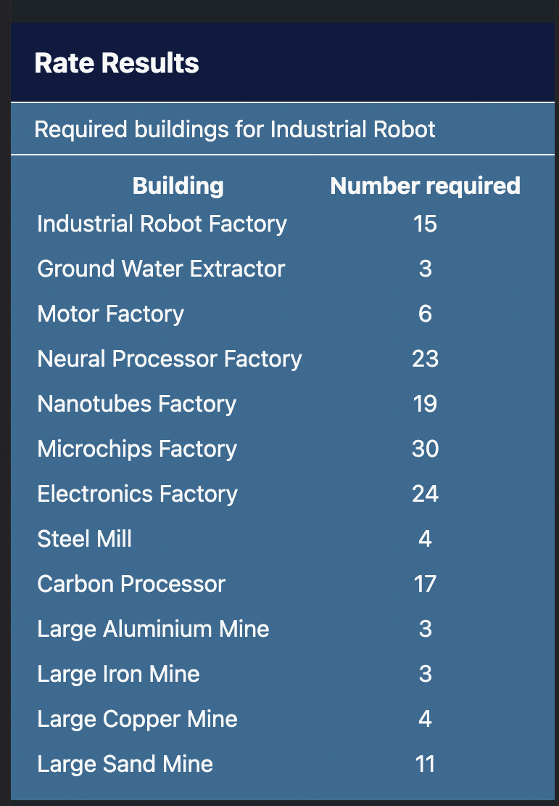

# InfraCalc - The InfraSpace Calculator

> Forked from the original [Quantra/infracalc](https://github.com/Quantra/infracalc)

> https://quantra.github.io/infracalc/

## Overview

  

## Usage

The calculator offers two modes: 

1. **Production Rate**
  To achieve a production rate of X number of resources per minute (or second). For example, _how many buildings to produce a single Home Robot per second?_ (_It's 67 when rounding_)
1. **Building Support**
  To support X number of buildings of a specific resource type.
  For example, _how many supporting buildings  are needed for each Home Robot factory?_ (_It's 17 when rounding_)

Selecting a mode will display the dedicated form for the specific calculation.

### Production Rate

1. Select the **Resource** to produce within the **Time Frame** 
1. Enter the **Amount** of Resources to produce
1. Choose the **Time Frame** &mdash; _per second_ or _per minute_
1. Click the **Calculate** button
1. Scroll to see the results

### Building Support

1. Select the **Building** type to support
1. Enter the **Amount** of buildings
1. Click the **Calculate** button.
1. Scroll to see the results

## Results

The math which is required to determine the number of buildings to build should not be expected to be even. It is very common for the results to reveal that a partial building is required to meet the criteria. Of course, InfraSpace does not provide partial options. In all of these cases, the building will be round to the next _highest_ building. For example, a resource requiring 1.1 buildings and a resource requiring 1.9 buildings would _both_ be rounded to 2 buildings. 

